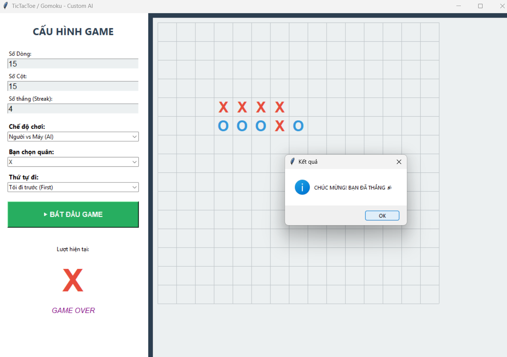

# Tic-Tac-Toe & Minimax Alpha-Beta Pruning

> Đồ án mô phỏng trò chơi Cờ Caro (Gomoku) và Tic-Tac-Toe tích hợp Trí tuệ nhân tạo (AI) sử dụng thuật toán **Minimax** kết hợp kỹ thuật cắt tỉa **Alpha-Beta Pruning**.


*(Ảnh minh họa giao diện game)*

## Giới thiệu

Dự án này là một ứng dụng Desktop Game được xây dựng bằng **Python**, cho phép người dùng chơi cờ Caro hoặc Tic-Tac-Toe với máy tính. 

Điểm đặc biệt của dự án là khả năng **tùy biến động**: Người chơi có thể tự thiết lập kích thước bàn cờ (ví dụ: 3x3, 10x10, 20x20) và số lượng quân cần thiết để thắng (3, 4, 5...). AI được thiết kế để xử lý linh hoạt các tình huống này mà không bị "tràn bộ nhớ" nhờ giới hạn độ sâu và hàm lượng giá (Heuristic).

## Tính năng nổi bật

1.  **Cấu hình Động (Dynamic Configuration):**
    * Tùy chỉnh số dòng ($Rows$) và số cột ($Cols$).
    * Tùy chỉnh điều kiện thắng (Streak): Ví dụ 3 con thắng, 5 con thắng.
2.  **Trí tuệ nhân tạo (AI) mạnh mẽ:**
    * Sử dụng thuật toán **Minimax** để tìm nước đi tối ưu.
    * Tối ưu hóa tốc độ bằng **Alpha-Beta Pruning** (Cắt tỉa nhánh).
    * Áp dụng **Hàm lượng giá (Heuristic)** để đánh giá thế trận trên bàn cờ lớn.
3.  **Tùy chọn linh hoạt:**
    * Chọn chế độ: **Người vs Người** (PvP) hoặc **Người vs Máy** (PvE).
    * Chọn quân cờ: Bạn thích cầm **X** hay **O** tùy ý.
    * Chọn quyền đi trước: Bạn đi trước (First) hoặc nhường Máy đi trước (Second).
4.  **Giao diện Đồ họa (GUI) hiện đại:**
    * Viết bằng thư viện `tkinter`.
    * Hỗ trợ **Zoom (Phóng to/Thu nhỏ)** bàn cờ.
    * Có thanh cuộn (Scrollbar) cho các bàn cờ kích thước lớn.
    * Hiển thị trạng thái lượt đi và thông báo kết quả trực quan.

## Yêu cầu hệ thống

* **Ngôn ngữ:** Python 3.x
* **Thư viện:** `tkinter` (Thường đã tích hợp sẵn trong Python), `math`, `random`.

## Hướng dẫn Cài đặt & Chạy

**Bước 1:** Clone hoặc tải dự án về máy.

```bash
git clone [https://github.com/Ngocc508/Minimax-Alpha-Beta]

Bước 2: Chạy file giao diện chính. game_gui.py
Bước 3: Tại bảng điều khiển bên trái:
    Nhập kích thước bàn cờ (VD: 15x15).
    Nhập số quân thắng (VD: 5).
    Chọn phe (X/O) và thứ tự đi.
Bấm nút "BẮT ĐẦU GAME".
Cấu trúc dự án
Dự án được tổ chức theo mô hình tách biệt Logic và Giao diện (MVC pattern):PlaintextTicTacToe-AlphaBeta/
├── game_logic.py     # MODEL: Chứa thuật toán Minimax, Alpha-Beta, Logic thắng thua
├── game_gui.py       # VIEW/CONTROLLER: Xử lý giao diện, sự kiện chuột, vẽ hình
├── README.md         # Tài liệu hướng dẫn
└── images/           # Thư mục chứa ảnh demo (nếu có)
 Giải thích Thuật toán AI của trò chơi hoạt động dựa trên thuật toán tìm kiếm đối kháng:
1. Minimax
Nguyên lý: AI (Max) luôn cố gắng chọn nước đi có điểm số cao nhất, đồng thời giả định rằng đối thủ (Min) sẽ luôn chọn nước đi làm cho AI bị điểm thấp nhất.
Độ sâu (Depth): Với bàn cờ 3x3, thuật toán duyệt đến tận cùng (lá). Với bàn cờ lớn (Gomoku), thuật toán giới hạn độ sâu (VD: depth=3) để đảm bảo hiệu năng.
2. Alpha-Beta Pruning (Cắt tỉa)
Đây là kỹ thuật giúp AI chạy nhanh hơn gấp nhiều lần bằng cách loại bỏ các nhánh vô nghĩa:
- Alpha : Giá trị tốt nhất mà Max đã tìm được.
- Beta : Giá trị tốt nhất mà Min đã tìm được (đối với Min, tốt nhất nghĩa là nhỏ nhất).
Quy tắc cắt tỉa: Nếu trong quá trình tìm kiếm, ta thấy beta hay alpha, ta lập tức dừng tìm kiếm ở nhánh đó vì nhánh đó không còn giá trị sử dụng.
3. Hàm Lượng Giá (Heuristic Function)
Vì không thể duyệt hết bàn cờ 15x15, tại độ sâu giới hạn, AI sử dụng hàm đánh giá thế cờ:
E(s) = Score(AI) - Score(Human) \times 1.2
Điểm số được tính dựa trên số lượng quân liên tiếp (Streak) và số đầu bị chặn (Blocked).
AI ưu tiên phòng thủ hơn một chút (hệ số 1.2) để tránh bị thua sớm.
Hình ảnh Demo1. 
Menu Cấu hình2. 
Chiến thắng trong Caro 3x33.
Giao diện Caro 15x15 (AI Chặn nước đi)
Tác giả: [Nguyễn Thị Ngọc - 2001230571] Môn học: Thực hành trí tuệ nhân tạo 